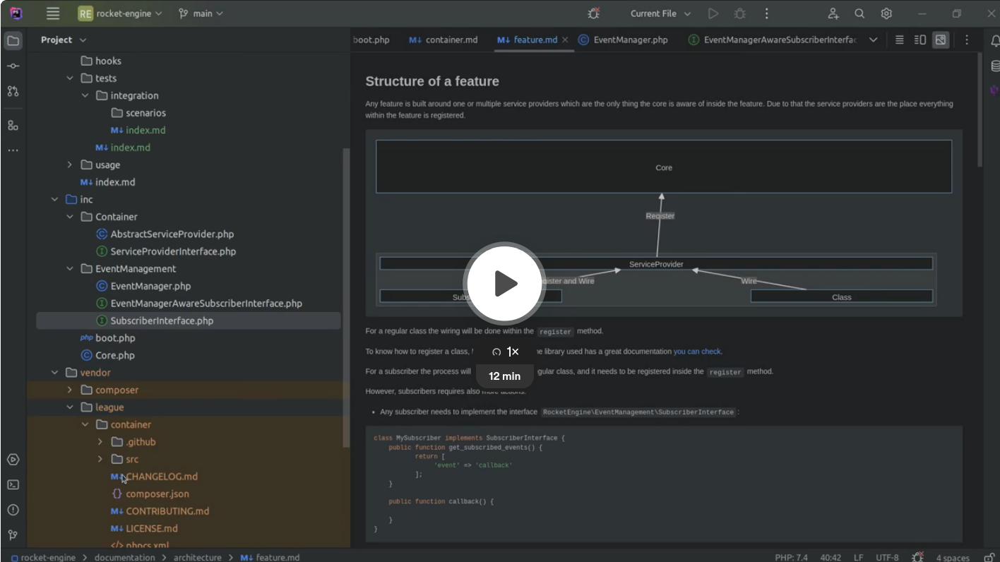
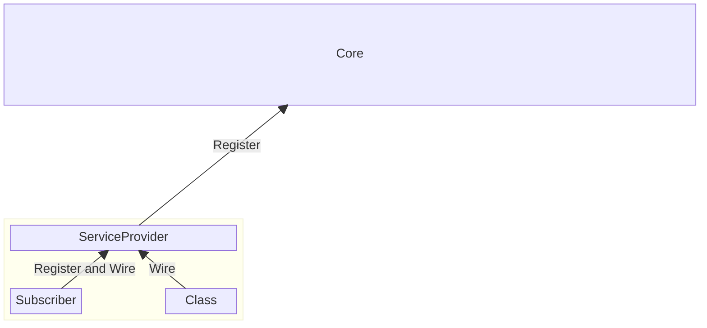
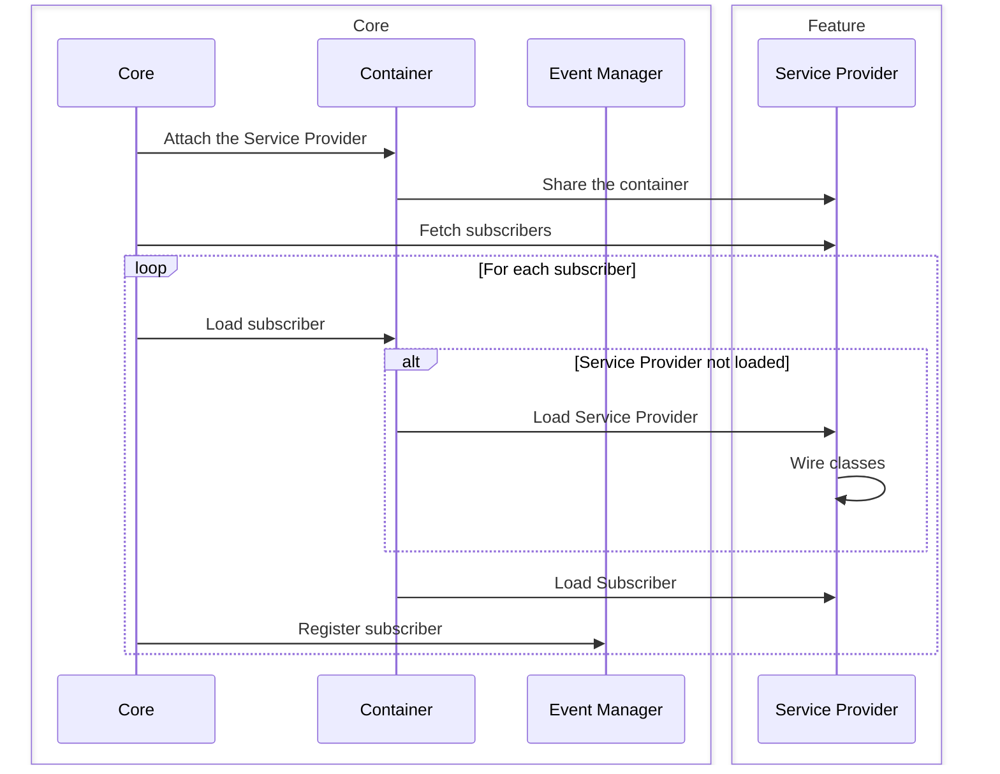
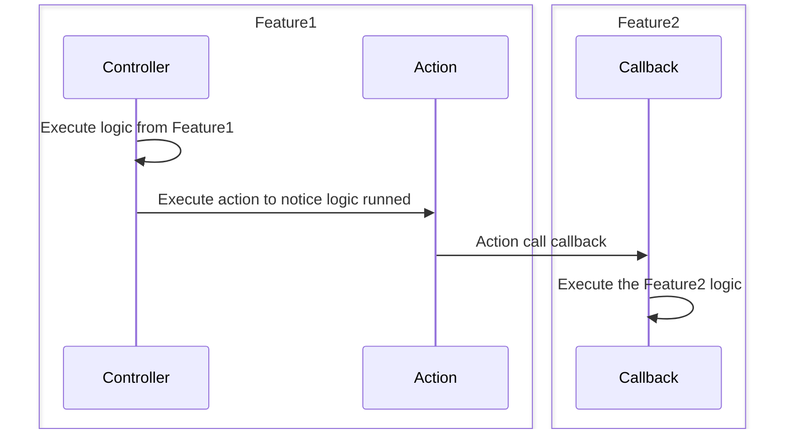
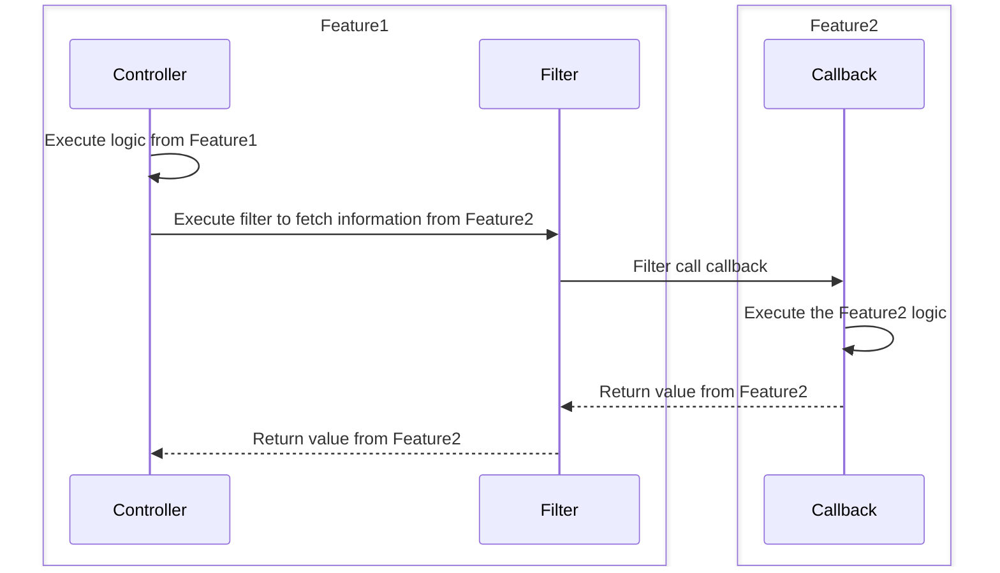

## Structure of a feature
Video:

[](https://www.loom.com/share/6f86422fb2924099a4e3262688c98015?sid=f614ce63-335a-4ad9-9e27-3e20bd43ed7c)

Any feature is built around one or multiple service providers which are the only thing the core is aware of inside the feature.
Due to that the service providers are the place everything within the feature is registered.



For a regular class the wiring will be done within the `register` method.

To know how to register a class, League container, the library used has a great documentation [you can check](https://container.thephpleague.com/3.x/#basic-usage).

For a subscriber the process will be the same as a regular class, and it needs to be registered inside the `register` method.

However, subscribers requires also more actions:

- Any subscriber needs to implement the interface `LaunchpadCore\EventManagement\SubscriberInterface`:
```php
class MySubscriber implements SubscriberInterface {
    public function get_subscribed_events() {
           return [
                'event' => 'callback'
           ];
    }
    
    public function callback() {
    
    }
}
```
- The subscriber should be registered into the method `get_common_subscribers`:
```php
public function get_common_subscribers() {
    return [
        MySubscriber::class,
    ];
}
```

## Loading



### Container attachement
The first step of the loading from a feature is the attachement to the container.

This step does two things:

- It makes the Service Provider existing for the container and make it aware of the classes the feature provides.
- It gives access to the container inside the Service Provider. Before that point the method `getContainer` returns null.

### Subscribers registration

The next step is the registration from the subscribers inside the WordPress API.

For that the core does the following things:

- Fetch subscribers list from the service provider using `get_common_subscribers`.
- Instantiate that subscribers using the container.
- Register them on the WordPress API using the event manager.

### Feature loading
By default, the library used, league container, is not loading classes registered on a service provider when the service provider is instantiated or attached to the container.

Instead, it lazyloads it until the container requires a class within that service provider.

So we can consider that a feature is not loaded into the plugin until a first class from that feature is loaded.

## Interact between two features

Each feature need to keep being isolated from each other to reduce coupling between features.

In that purpose using directly classes from another feature is prohibited.

However, other solutions exists to make two features interact.

The one strongly recommended is to use actions and filters.

For actions, it will be used when the feature needs to execute logic based on logic within another feature and
follows this process:


For filters, it will be used in the case information about the state of another feature is necessary and follows this process:


In that way it is possible to create an interaction between two features without them knowing the internal behavior of each other.

This is important as it reduce a lot the chances to make an error while maintaining the code.

All the logic concerning a feature will be used only within the feature, and it will be possible to refactor a class without having to each inside the whole plugin.

Also, a change in the behavior of the feature is also less likely to generate an issue on another feature if the implementation is changed.
