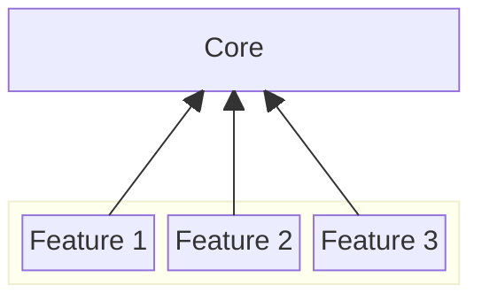
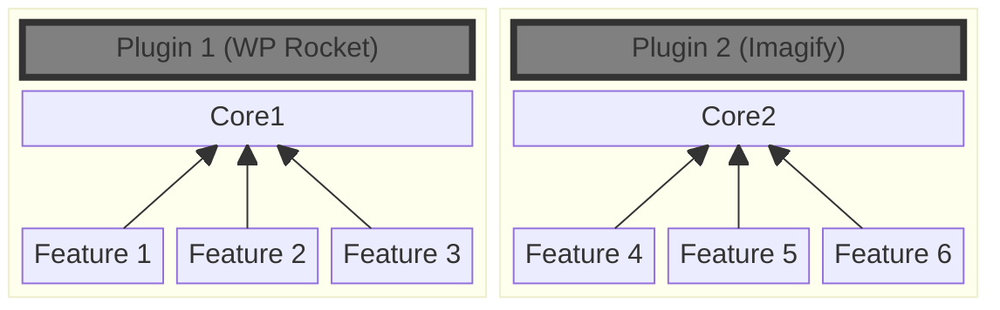
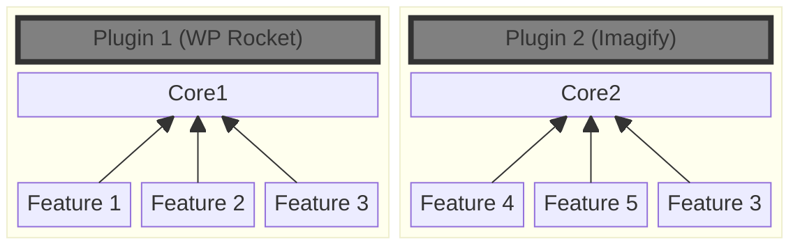
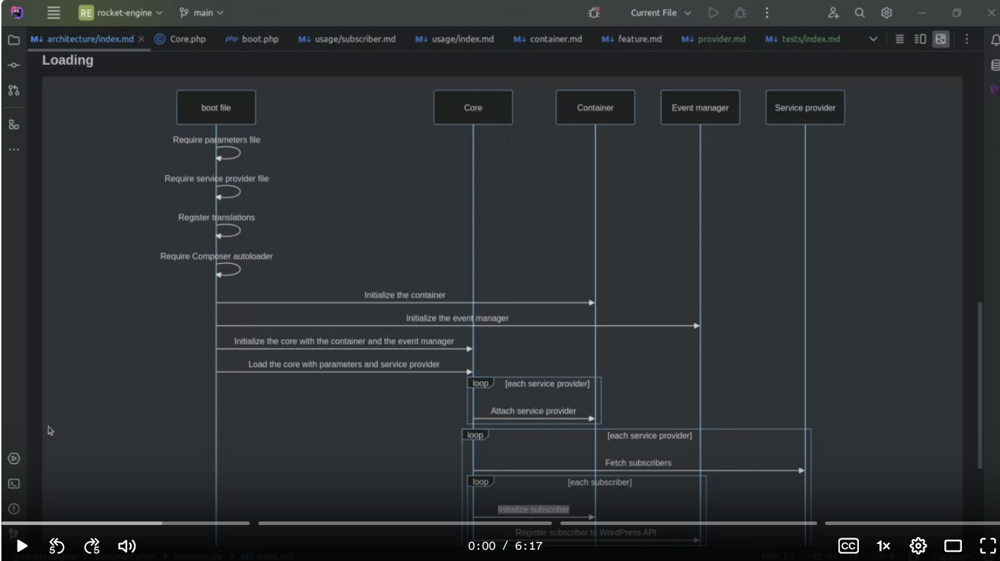
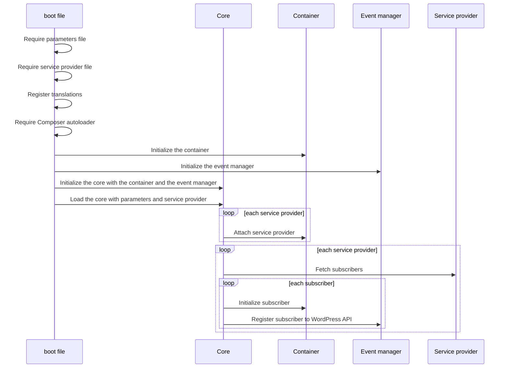

The core is here to centralize all the logic related to WordPress plugins and leave the business logic only to the plugin developers.

Each plugin using the core is interacting with it to handle logic related to the common plugin tasks.

This way it is possible to focus only on business logic while developing plugins.

## Advantage of using one core

### Code duplication
When using the core the code used for plugin logic will be shared between all teams.

This way the code duplication between teams will be reduced as only the business logic will remain which is heavily linked to the business requirements from that plugin and so unique.

Without a common core

With a common core
### Code disparity

The core comes with an architecture but also recommendations which are common to all the projects.

This way the code will be working and organized a similar way between each plugin, and it will be easier to switch from one to another when it is necessary. 

### Interoperability

As the only interface needed by the core to load a feature is the service provider from that feature, it will be now possible to create libraries or features which going to be common to multiple plugins.

That preventing again code duplication between plugins but also enhancing interoperability from the code.

Using a common core allows to have this situation possible without reimplementing Feature 3 twice.

## Loading

Video: 

When loading the core follows this steps:
- It loads the parameters from the plugin
- It loads the service providers from the plugin
- It registers translations for the WordPress environment
- It loads Composer autoloader which going to allow the usage from libraries
- It initializes the container which going to be used later on to provide access to any class within the plugin
- It initializes the event manager which link subscribers with the WordPress API.
- It calls the `load` method from the `Core` to load the plugin 
- It registers each service providers on the container giving access to the class from the features.
- For each service provider it fetches the list of subscribers:
  - It instantiates the subscriber
  - It registers it to the WordPress API through the event manager

