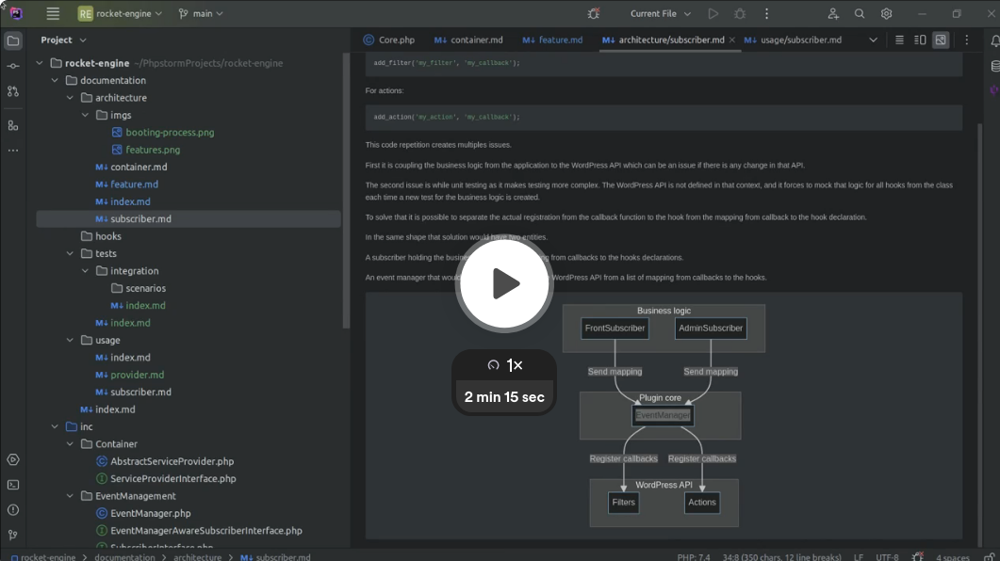

Video:

[](https://www.loom.com/share/b6f09f2eee55491086dd1dd5e6dafbb8?sid=fb1c6811-40b0-4eeb-9cb0-38bde5408bd9)

One characteristic from the WordPress code is that anything starts with a hook callback registration.

This makes the code heavily relying on the WordPress hook API and the logic to register hook is repeated over and over leading to these block of code to be present anywhere inside the plugin:

For filters:
```php
add_filter('my_filter', 'my_callback');
```
For actions:
```php
add_action('my_action', 'my_callback');
```

This code repetition creates multiples issues.

First it is coupling the business logic from the application to the WordPress API which can be an issue if there is any change in that API.

The second issue is while unit testing as it makes testing more complex.
The WordPress API is not defined in that context, and it forces to mock that logic for all hooks from the class each time a new test for the business logic is created.

To solve that it is possible to separate the actual registration from the callback function to the hook from the mapping from callback to the hook declaration.

In the same shape that solution would have two entities.

A subscriber holding the business logic and the mapping from callbacks to the hooks declarations.

An event manager that would be registering hooks to the WordPress API from a list of mapping from callbacks to the hooks.


