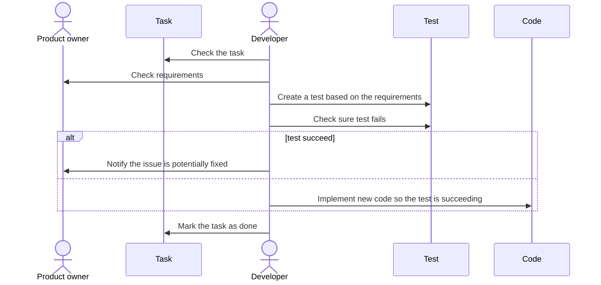
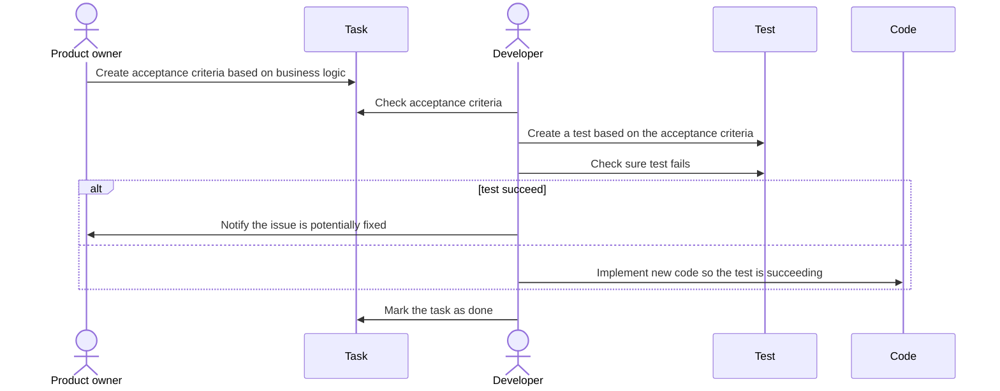

## Tests

### Acceptance criteria

An acceptance criteria is here to solve an issue.
Often issues are describing the task, but they are not defining how the application should behave once the task is done.

Acceptance criteria are a couple of sentences each one describing an atomic behavior from the application that should be met once the task is done.

This way it is now possible for the developer to easily check the changes are following requirements without having any assistance from the person who created the task.

This can seem a bit overkill. However, often tasks can stack up in the backlog for weeks if it is not months or years. Having the done description in this case is even more useful as in this case the person who created the task might have forgot what was the initial request.

Without Acceptance criteria

With Acceptance criteria

### Testing strategy

When trying to have effective testing is key to pick the right testing strategy.

For WP Media plugins, the focus is putted on integration testing.

The idea behind that is that these tests offer multiples advantages:

- They are business oriented, so it is possible to insure plugins are actually behaving how it is expected.
- They are black box tests, so they don't rely on the implementation from feature which make them insensitive to change

However, it is not possible to test all the plugin features with integration tests so when it is the case then unit tests should be used to cover that part of the code.

### TDD approach

#### Integration tests

#### Unit tests