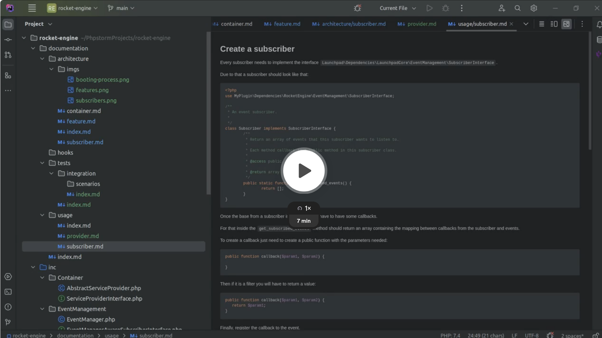

Video:

[](https://www.loom.com/share/0e199235172b4171be4beee1e67bc029?sid=3e286c88-d85a-4c4d-b1cf-7333e8bbddc4

## Create a subscriber

Every subscriber needs to implement the interface `Launchpad\Dependencies\LaunchpadCore\EventManagement\SubscriberInterface`.

Due to that a subscriber should look like that:
```php
<?php
use MyPlugin\Dependencies\LaunchpadCore\EventManagement\SubscriberInterface;

/**
 * An event subscriber.
 *
 */
class Subscriber implements SubscriberInterface {
	/**
	 * Return an array of events that this subscriber wants to listen to.
	 *
	 * Each method callback is a public method in this subscriber class.
	 *
	 * @access public
	 *
	 * @return array
	 */
	public static function get_subscribed_events() {
		return [];
	}
}
```

Once the base from a subscriber is created then it have to have some callbacks.

For that inside the `get_subscribed_events` method should return an array containing the mapping between callbacks from the subscriber and events.

To create a callback just need to create a public function with the parameters needed:
```php 
public function callback($param1, $param2) {

}
```
Then if it is a filter you will have to return a value:
```php 
public function callback($param1, $param2) {
   return $param1;
}
```

Finally, register the callback to the event.

For that there is multiple syntaxes:
- The easiest way is to just register the callback: `'hook_name'   => 'method_callback'`.
- If you need to register the callback with a priority or more than one param, you can then use the array syntax: `'hook_name_3' => [ 'method_callback_3', 10, 2 ],`
- If there is multiple callbacks then it will have to use the array syntax wrapped into an array: `'hook_name_4' => [
  [ 'method_callback_4' ],
  [ 'method_callback_5' ],
  ],`

At the end it should have this structure for the subscriber:
```php
<?php

use MyPlugin\Dependencies\LaunchpadCore\EventManagement\SubscriberInterface;

/**
 * An event subscriber.
 *
 */
class Subscriber implements SubscriberInterface {
	/**
	 * Return an array of events that this subscriber wants to listen to.
	 *
	 * Each method callback is a public method in this subscriber class.
	 *
	 * @access public
	 *
	 * @return array
	 */
	public static function get_subscribed_events() {
		return [
			'hook_name'   => 'method_callback', // With no parameters for the hook
			'hook_name_2' => [ 'method_callback_2', 10 ], // With the priority parameter
			'hook_name_3' => [ 'method_callback_3', 10, 2 ], // With the priority & number of arguments parameters
			'hook_name_4' => [
			    [ 'method_callback_4' ], // Multiple callbacks can be hooked on the same event with a multidimensional array
			    [ 'method_callback_5' ],
			],
		];
	}
	
       public function method_callback_1($param1) {

       }
	
       public function method_callback_2($param1) {

       }

       public function method_callback_3($param1, $param2) {

       }
       
       public function method_callback_4($param1) {
          return $param1;
       }
       
       public function method_callback_5($param1) {
          return $param1;
       }
}
```

## Register a subscriber
Once the subscriber is created then it needs to be attached to the plugin as an actual subscriber instead of a simple class.

For that it needs to be registered on a ServiceProvider as a subscriber.

The subscriber should be registered into the method `get_common_subscribers` the following way:
```php
public function get_common_subscribers() {
    return [
        MySubscriber::class,
    ];
}
```