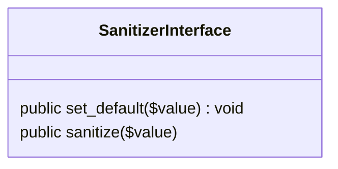
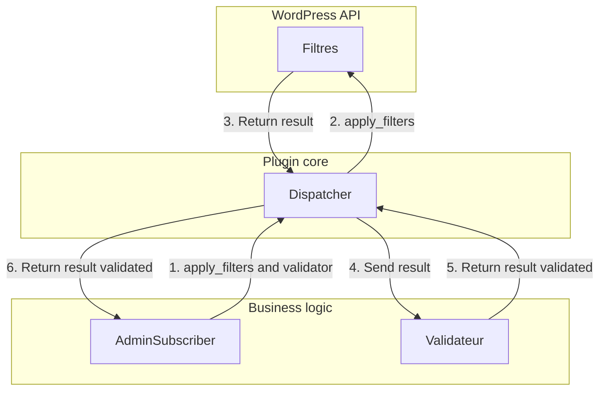
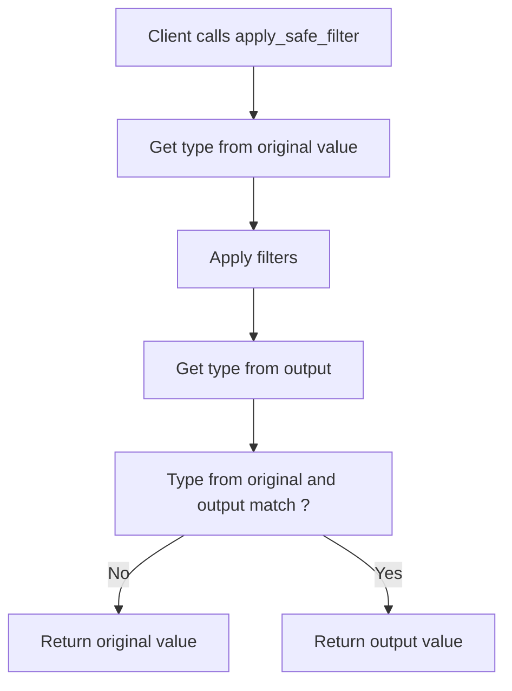

As for the functions `add_action` or `add_filter` a direct call to the functions `apply_filters` and `do_action` is also not wanted.

For that reason they will be wrapped into a `Dispatcher` class which going to abstract them and reduce the amount of effort if for any reason they have to change.

That class is also a great opportunity to get rid of the complexity from the filter return values validation and from the prefix before custom hooks.

First lets just wrap the two problematic functions.

```php
class Dispatcher {
    public function apply_filters(string $name, $value, ...$context = []) {
        return apply_filters($name, $value, ...$context);
    }
    
    public function do_action(string $name, ...$context = []) {
        do_action($name, ...$context);
    }
}
```

Once this is done then it is now time to prefix automatically the hooks. This will improve the developer experience by preventing a developer error, but it will also make the hook shorter to write.

```php
class Dispatcher {
    protected $prefix;

    public function __construct(string $prefix) {
        $this->prefix = $prefix;
    }

    public function apply_filters(string $name, $value, ...$context = []) {
        return apply_filters($this->prefix . $name, $value, ...$context);
    }
    
    public function do_action(string $name, ...$context = []) {
        do_action($this->prefix . $name, ...$context);
    }
}
```

Note: Here we take as an assumption that external hooks won't be defined within the plugin but if it is the case then creating new methods `apply_external_filters` and `do_external_action` will make the trick.

Finally, the last step is to internalize the validation from the output from hooks within the dispatcher to reduce the chances of making a mistake for the developer.

For that new methods will have to be added to validate each basic types and to leave a generic case.

First problem will be to solve the issue in a generic way so then some particular solutions can be created for the basic types.

As validation is something complex, and it is better to not force the developer into a certain way of validation an interface will be used.


Which correspond to the following code:

```php
interface SanitizerInterface
{
    public function sanitize($value);

    public function set_default($value): void;
}
```



However even this logic is perfect to adapt to each situation and edge cases it is also really verbose logic for the user from the `apply_filters` method to just assert the output variable is the same type as the output one.

This is why it is now necessary now to simplify it.

For there is an easy way using the `getype` function which going to provide the information wanted.

In a first, the function `gettype` will be used on the original value to know the type from the original value.

Then it will be used another type on the output value after filters applied.

If the types mismatch then the original value will be returned otherwise the output value will be returned to the user.



This corresponds to the following code:

```php
    public function apply_safe_filters(string $name, $value, ...$context = []) {
        $original_type = gettype($value);
        
        $output_value = apply_filters($name, $value, ...$context);
        
        if($original_type !== gettype($original_type)) {
            return $value;
        }
        
        return $output_value;
    }
```

