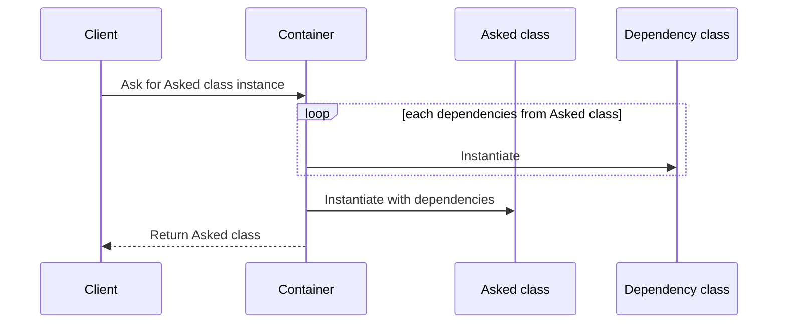
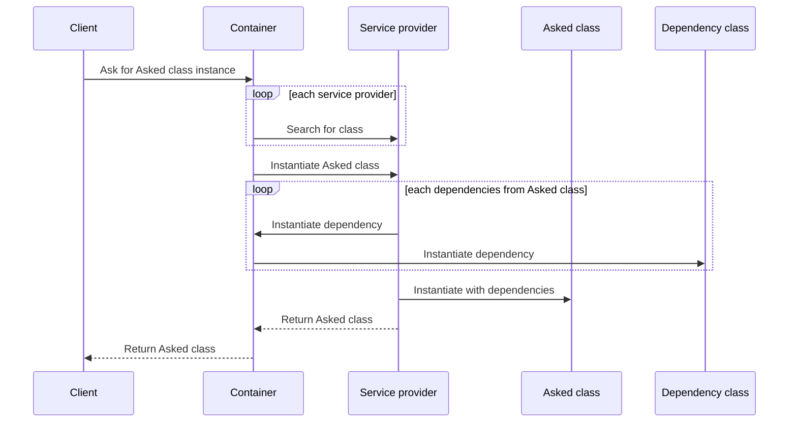

When writing some code there is always a need for wiring classes to each other.
For simple software it is often a two-way to go solution.

On one hand it is possible to wire classes inside the core from the software.
This makes it easy to test as it gives control over the dependencies to mock them.
It also allows to use interfaces and create some level of abstraction between components.

However, on another hand it is centralizing all the wiring logic into one place which makes it prone to conflicts on versioning tools as each time a change is done related to classes organization some modification is added to that file.

The second solution is to add classes wiring inside the constructor for the class needing them.

This prevents conflicts as now classes organization is now split between each class.
However, the main drawback is that now it is really hard to mock classes as it is not anymore possible to mock classes.

Inversion of dependencies enters here. This solution provides us both benefits without the drawbacks.

| Solution                   | Can test | Not conflict prone | Can create abstraction |
|----------------------------|----------|--------------------|------------------------|
| Wiring inside the core     | Yes      | No                 | Yes                    |
| Wiring inside constructors | No       | Yes                | No                     |
| Inversion of dependencies  | Yes      | Yes                | Yes                    |

The inversion of dependencies is based on wiring inside the core but instead of directly wire it will rely on a container to make the wiring between classes.

This way the wiring logic is not anymore done by the core from the software, but it is still centralized.
To tackle this issue two solution can be picked with each one their drawbacks.

Rely on the reflection to make the wiring which makes the wiring disappear but has the issue of being slow and memory intensive.

Create another layer of abstraction to break down the wiring per feature using service providers.

A service provider will contain only the wiring for the feature it is related to and will be attached to the container to then be used to instantiate classes.

| Solution          | Coding time | Chances of conflicts | Memory usage |
|-------------------|-------------|----------------------|--------------|
| Basic container   | High        | High                 | Low          |
| Reflection        | None        | None                 | High         |
| Service providers | High        | Low                  | Low          |
