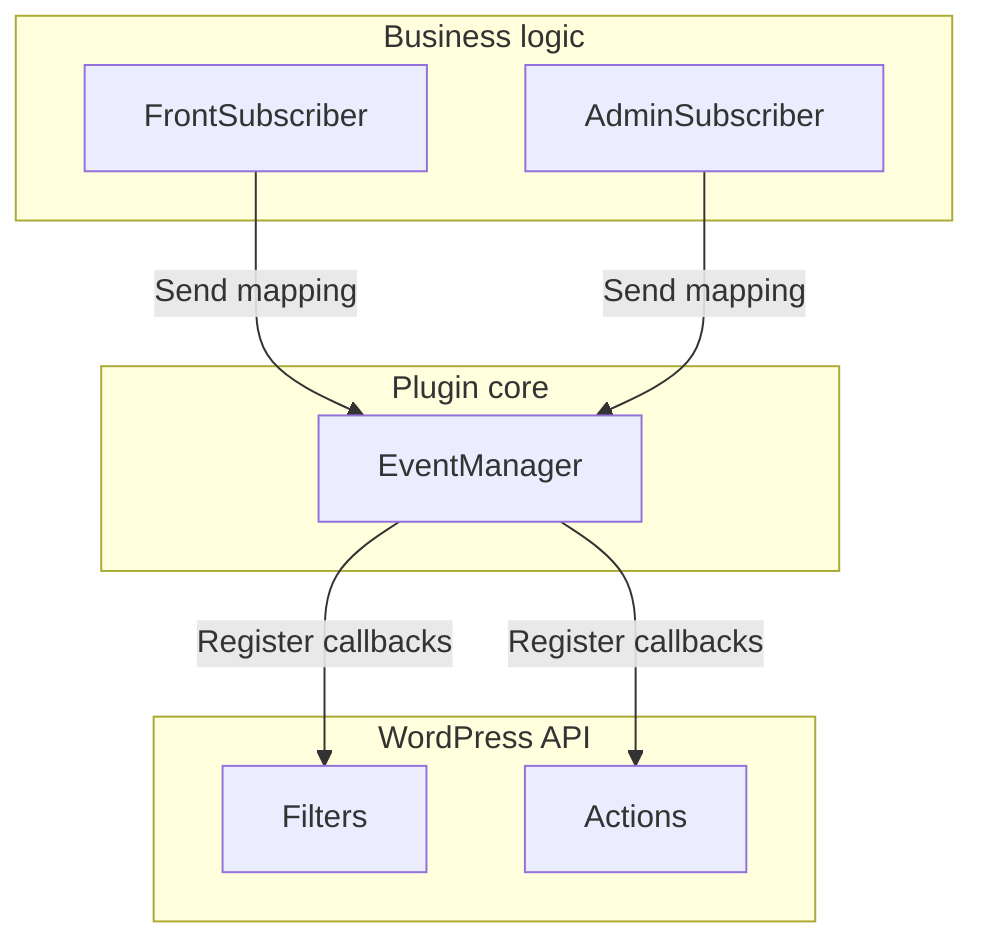
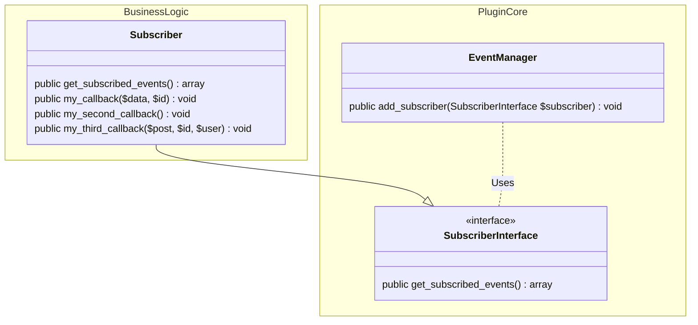
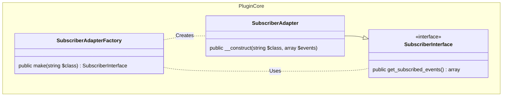
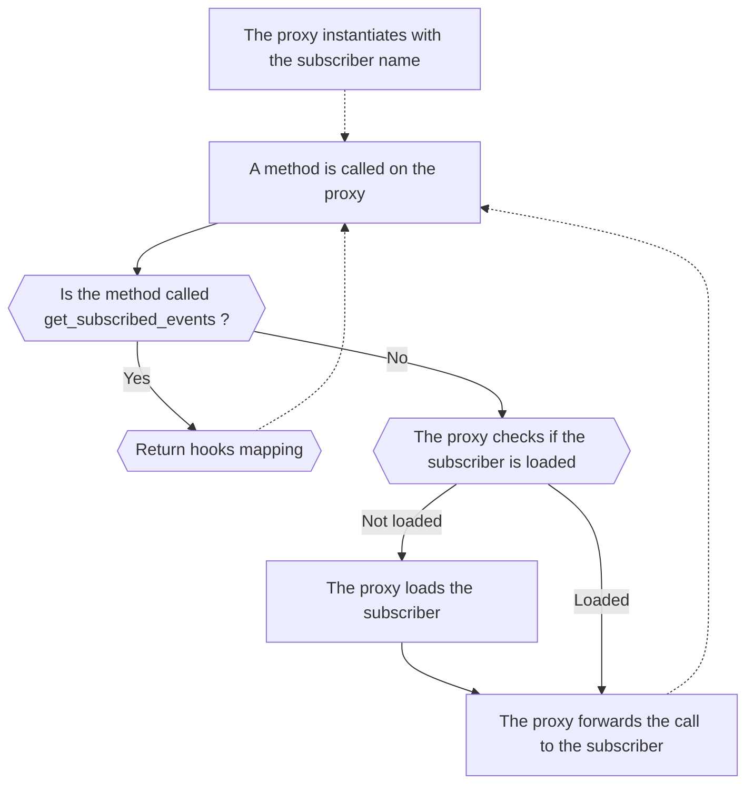

One characteristic from the WordPress code is that anything starts with a hook callback registration.

This makes the code heavily relying on the WordPress hook API and the logic to register hook is repeated over and over leading to these block of code to be present anywhere inside the plugin:

For filters:
```php
add_filter('my_filter', 'my_callback');
```
For actions:
```php
add_action('my_action', 'my_callback');
```

This code repetition creates multiples issues.

First it is coupling the business logic from the application to the WordPress API which can be an issue if there is any change in that API.

The second issue is while unit testing as it makes testing more complex.
The WordPress API is not defined in that context, and it forces to mock that logic for all hooks from the class each time a new test for the business logic is created.

To solve that it is possible to separate the actual registration from the callback function to the hook from the mapping from callback to the hook declaration.

In the same shape that solution would have two entities.

A subscriber holding the business logic and the mapping from callbacks to the hooks declarations.

An event manager that would be registering hooks to the WordPress API from a list of mapping from callbacks to the hooks.



Now that the overall picture is given it is now time to go into the implementation details.

For the mapping an array will be using following that format.

Each key from the array will the name of the hook to register.

Each value from the array will be an array for each callback linked to that hook.
Each callback being defined by three elements:
- the name from the callback method.
- the priority of that callback.
- the number of parameters from the callback.

To summarize it will have the following shape.

```php
[
    "my_hook" => [
        [
            "my_callback",
            10,
            2
        ],
        [
            "my_second_callback",
            10,
            0
        ],
    ],
    "my_second_hook" => [
        [
            "my_third_callback",
            10,
            3
        ],
    ],
]
```

This is this data that will the interface for callback and hooks mapping between the subscribers and the event manager.

Note: It is not necessary to indicate if the hook is a filter or an action inside the mapping.

This is due to the fact that for WordPress actions are filters that return nothing.
Due to that it is possible to register an action callback as a filter callback, and it will be still called while using `do_action` method.

The event manager system translates to that classes.


With the following code for `SubscriberInterface` interface.
```php
interface SubscriberInterface {
    public function get_subscribed_events() array;
}
```

For the `Subscriber` it will have to implement the `get_subscribed_events` from the `SubscriberInterface` interface to return the mapping from callbacks to their respective hooks.
```php
class Subscriber implements SubscriberInterface {
    public function get_subscribed_events() array {
        return [
                    "my_hook" => [
                        [
                            "my_callback",
                            10,
                            2
                        ],
                        [
                            "my_second_callback",
                            10,
                            0
                        ],
                    ],
                    "my_second_hook" => [
                        [
                            "my_third_callback",
                            10,
                            3
                        ],
                    ],
                ];
    }
    
    public function my_callback($data, $id): void {
        // logic from the callback
    }
    
    // other callback methods
}
```

Finally, the last step is to implement the event manager.

First the method `add_callback` will have to implemented to register a callback.
To register hooks it is possible to use only the function `add_filter` as for WordPress actions are in fact filters that returns nothing.

```php
    protected function add_callback( $hook_name, $callback, $priority = 10, $accepted_args = 1 ) {
        add_filter( $hook_name, $callback, $priority, $accepted_args );
    }
```

Once the method `add_callback` is created then the wiring between the `add_subscriber` method and the callback registration needs to be created to register all callbacks for each hook when a subscriber is passed.

```php
class EventManager {
    public function add_subscriber( SubscriberInterface $subscriber ): void {
       
        $events = $subscriber->get_subscribed_events();

        if ( empty( $events ) ) {
            return;
        }

        foreach ( $events as $hook_name => $parameters ) {
               if( ! is_array( $parameters ) ) {
                    $class_name = get_class($subscriber);
                    throw new Exception("Invalid hook format for $hook_name from $class_name ");
               }
        
            $this->add_callback( $hook_name, [ $subscriber, $parameters[0] ], isset( $parameters[1] ) ? $parameters[1] : 10, isset( $parameters[2] ) ? $parameters[2] : 1 );
        }
    }
    
    protected function add_callback( $hook_name, $callback, $priority = 10, $accepted_args = 1 ) {
        add_filter( $hook_name, $callback, $priority, $accepted_args );
    }
}
```

Finally, the last step is to wire everything inside the main plugin PHP file.

```php
$event_manager = new EventManager();

$subscriber = new Subscriber();

$event_manager->add_subscriber($subscriber);
```

This way the business logic is now decoupled from the WordPress API and in case future changes are needed to be related to that it would impact only the event manager and not anymore the business logic.

In the same way it is also possible to unit test the business logic without having to mock `add_filter` and `add_action` functions.

However, the definition from the subscriber is verbose and needs to be simplified to make it easier for the developer and less error-prone.

A good interface would be using a docblock as following and abstract the hook registration.

```php
/**
* @hook my_hook 10
 */
public function my_callback() {

}
```

To achieve that two steps would have to be added to the previous process.

First a detection from the hooks inside the doc-blocks from each method from subscribers.

Second an adapter to make the new subscriber type able to work with the event manager which requires an `SubscriberInterface` type to register the callbacks.



With the following code for the `SubscriberAdapter`.

```php
class SubscriberAdapter implements SubscriberInterface
{

    protected $object;

    protected $events;

    public function __construct( $object, array $events = [] )
    {
        $this->object = $object;
        $this->events = $events;
    }

    public function get_subscribed_events(): array
    {
        return $this->events;
    }

    public function __call($name, $arguments)
    {


        if( method_exists( $this, $name ) ) {
            return $this->{$name}(...$arguments);
        }

        return $this->object->{$name}(...$arguments);
    }
}
```

And the following logic for `SubscriberAdapterFactory` .

```php
class SubscriberAdapterFactory
{
    public function make($object): SubscriberInterface
    {
        $methods = get_class_methods($object);
        $reflectionClass = new ReflectionClass($object);
        $events = [];
        foreach ($methods as $method) {
            $method_reflection = $reflectionClass->getMethod($method);
            $doc_comment = $method_reflection->getDocComment();
            if ( ! $doc_comment ) {
                continue;
            }
            $pattern = "#@hook\s(?<name>[a-zA-Z\\\-_$/]+)(\s(?<priority>[0-9]+))?#";

            preg_match_all($pattern, $doc_comment, $matches, PREG_PATTERN_ORDER);
            if(! $matches) {
                continue;
            }

            foreach ($matches[0] as $index => $match) {
                $hook = $matches['name'][$index];

                $events[$hook][] = [
                    $method,
                    key_exists('priority', $matches) && key_exists($index, $matches['priority']) && $matches['priority'][$index] !== "" ? (int) $matches['priority'][$index] : 10,
                    $method_reflection->getNumberOfParameters(),
                ];
            }
        }

        return new SubscriberAdapter($object, $events);
    }
}
```

Once the two parts are implemented then it is time to add it to the previous logic to load the new subscribers.

```php
$event_manager = new EventManager();

$subscriber = Subscriber::class;

$subscriber_adapter_factory = new SubscriberAdapterFactory();

$subscriber = $subscriber_adapter_factory->make($subscriber);

$event_manager->add_subscriber($subscriber);
```

With that new logic it is possible to load subscribers using doc-blocks for registering hooks.

However, even now subscribers are more pleasant to work with a major issue is still present.
Currently, all subscribers will be loaded on the initial load from the plugin even they are not used.

For a small plugin that is not an issue but when it is going to grow then this will become a performance issue that needs to be tackled.

For that a lazy load from the subscribers will have to be implements, so they will be loaded just in time when they are needed.

To achieve this the `SubscriberAdapter` class will have to become a proxy class which will handle the lazy load logic from the subscriber the following way.



Which is going to translate to the following implementation.

```php
class SubscriberProxy implements SubscriberInterface
{

    protected $object;

    protected $events;

    protected $instance;

    public function __construct( string $object, array $events = [] )
    {
        $this->object = $object;
        $this->events = $events;
    }

    public function get_subscribed_events(): array
    {
        return $this->events;
    }

    public function __call($name, $arguments)
    {


        if( method_exists( $this, $name ) ) {
            return $this->{$name}(...$arguments);
        }
        
        if( ! $this->instance ) {
            $this->instance = new $this->object;
        }

        return $this->instance->{$name}(...$arguments);
    }
}
```

And the following modification inside `SubscriberAdapterFactory` which going to be renamed `SubscriberProxyFactory`.

```php
class SubscriberProxyFactory
{
    public function make(string $object): SubscriberInterface
    {
        $methods = get_class_methods($object);
        $reflectionClass = new ReflectionClass($object);
        $events = [];
        foreach ($methods as $method) {
            $method_reflection = $reflectionClass->getMethod($method);
            $doc_comment = $method_reflection->getDocComment();
            if ( ! $doc_comment ) {
                continue;
            }
            $pattern = "#@hook\s(?<name>[a-zA-Z\\\-_$/]+)(\s(?<priority>[0-9]+))?#";

            preg_match_all($pattern, $doc_comment, $matches, PREG_PATTERN_ORDER);
            if(! $matches) {
                continue;
            }

            foreach ($matches[0] as $index => $match) {
                $hook = $matches['name'][$index];

                $events[$hook][] = [
                    $method,
                    key_exists('priority', $matches) && key_exists($index, $matches['priority']) && $matches['priority'][$index] !== "" ? (int) $matches['priority'][$index] : 10,
                    $method_reflection->getNumberOfParameters(),
                ];
            }
        }

        return new SubscriberAdapter($object, $events);
    }
}
```

Now the performance issue is finally addressed the subscribers are finally completed and allow clean code while not making the developer experience or performance any worse.