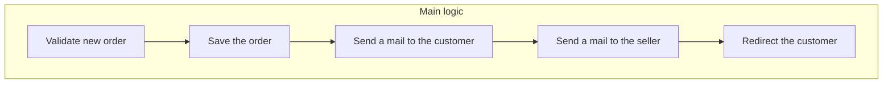
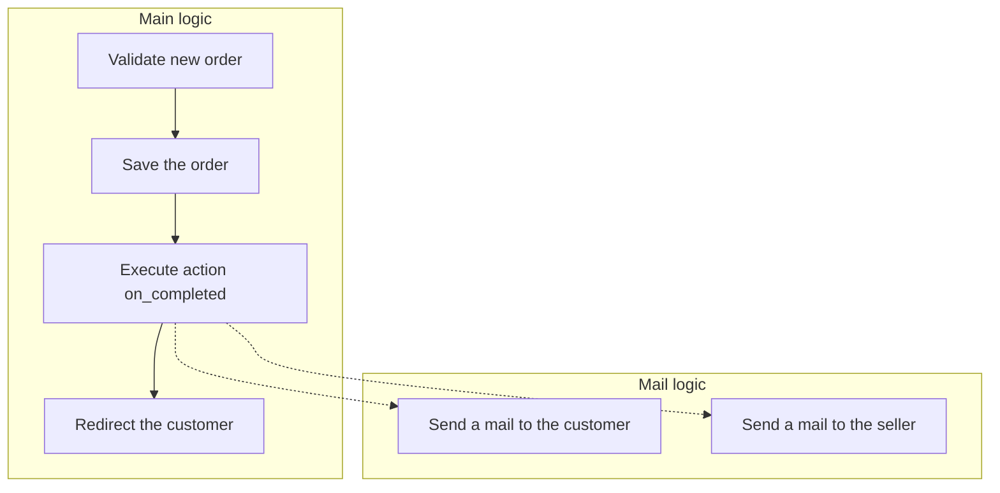
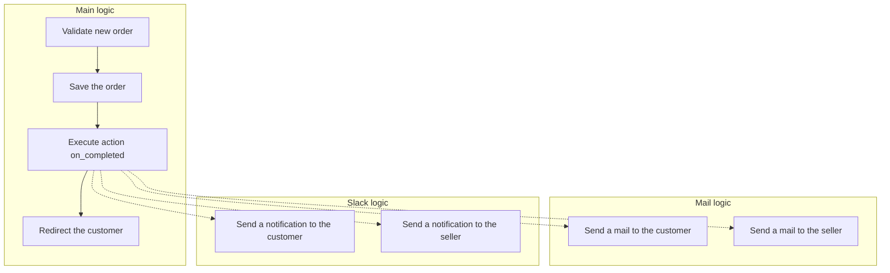

Code is not something written in the marble and tends to be more the opposite.

That's why often what makes the difference between a good and a bad developer on the long term can be resumed to code coupling.

Code coupling is the capacity to change a part of the code without affecting another part.

Hooks are here to help to decouple the code.

They provide an easy way to create an interface to abstract the processes and prevent the mix of concerns between the two sides of it.

This prevents mistakes done one a part to impact another.

For the example of an e-commerce order it can be seen as following.

If nothing is decoupled then everything is done within the same logic and due to that it is easy to make a mistake as everything is in the same context.
Also, any future changes in the needs would force the developer to go back inside the code and understand it to change anything.

When an action is used to decouple the logic to send the mails then there are two blocks.

The first block is linked with the main logic and will change if the main business logic to validate the order changes.

The second block is linked with mails and changes if there is any changes inside the mails.

This makes it easier to make modifications into mails which are more often subject to change than the main business logic.
This is due to the fact that when working with mails the main business logic is abstracted and the  developer only have to focus on the mail part.

Finally, this solution is also more friendly with future changes in the needs as if Slack notifications are now needed on top of the mails it is possible to add them easily without any risks from breaking the mails part or the main business logic.