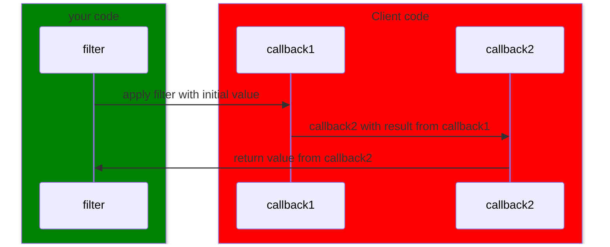
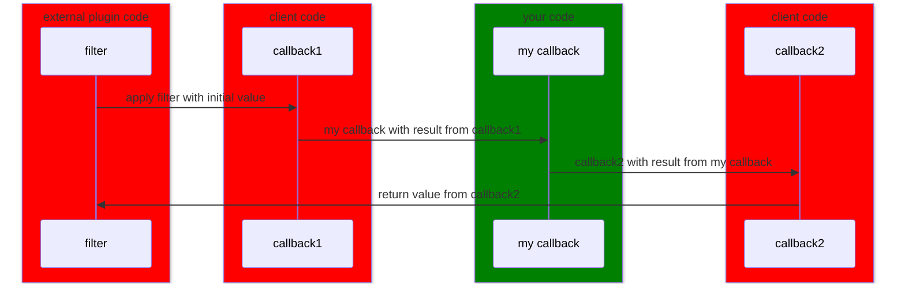

When using a filter we are relying on client code to potentially change the initial value.

Due to that we are not sure that we value will be always valid, and it is a good practice to validate the value before using it.

For primitives types as integer, float or boolean we can cast the output value as following:
- `boolean`: `$value = (bool) apply_filters('my_filter', true);`
- `integer`: `$value = (int) apply_filters('my_filter', 10);`
- `float`: `$value = (float) apply_filters('my_filter', 10.0);`

However, for more complex validation or other types, it is better to have a manual validation.
For example for a string or an array it would be better to check if the returned value is the right type rather than casting which could lead to a fatal error.

For a string that would give the following:
```php
$initial = 'my_value';

$value = apply_filters('my_filter', $initial);

if ( ! is_string( $value ) ) {
    $value = $initial;
}
```

For an array it would look like that:
```php
$initial = [];

$value = apply_filters('my_filter', $initial);

if ( ! is_array( $value ) ) {
    $value = $initial;
}
```

It is also important when we have more constraints on the output from the filter than the type to check them.

For example for a price it is possible to check it that way.
```php
$initial = 15.20;
$value = (float) apply_filters('my_filter', $initial);

if ( ! $value < 0 ) {
    $initial = $value;
}

$value = round( $value, 2 );

```

Note: It is important to understand this notion also applies to the values we expect inside the callback.

This is why it is important to never includes inside the function parameters from the callback the types. Otherwise, this could lead to the whole website crash due to a fatal if a previous callback returns an invalid type.

