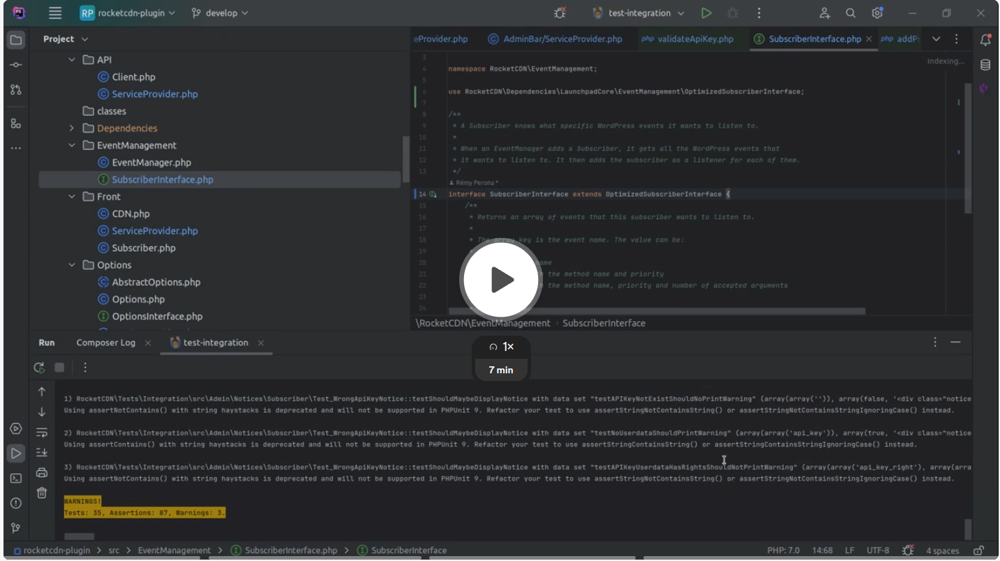

## All projects are different

All WordPress plugins are shaped in a different way and this is the strength of WordPress but also its worse weakness.

This is why it is not possible to provide you one clear tutorial about how to migrate your plugin toward Launchpad.

However, it is still possible to guide you toward the right path to integrate Launchpad into your plugin.

### Core vs Framework

The best is always to have the full framework.

However, when migrating a plugin already existing to Launchpad it is better to do it gradually and for that we can provide you different strategies based on how your plugin is built.

### WP Media standards

If your plugin is already following WP Media standards then you will be able to migrate following this tutorial:

[](https://www.loom.com/share/0370ddf6526d4043a8fe5f2cc0b32c61?sid=d6627e4c-d997-4fe9-b89b-901117f4b19f)

1. Remove any potential use of the `league/container` inside dependencies.
2. Add and protect the `wp-launchpad/core` with `coenjacobs/mozart` or `brianhenryie/strauss`.
3. Extend subscriber interface from `Launchpad\Dependencies\LaunchpadCore\EventManagement\OptimizedSubscriberInterface`
4. Implement `Launchpad\Dependencies\LaunchpadCore\Container\ServiceProviderInterface` on each service provider or extend `Launchpad\Dependencies\LaunchpadCore\Container\AbstractServiceProvider`.
5. Add each one of your subscribers inside the matching ServiceProvider.
6. Create a folder `configs`.
7. Create the file `configs/parameters.php` with the following content:
```php
return [
    'plugin_name'     => sanitize_key( 'My plugin name' ),
    'is_mu_plugin'    => false,
    'translation_key' => 'my-plugin',
    'prefix'          => 'my_plugin_'
];
```
8. Create the file `configs/providers.php` with each service providers listed inside:
```php
return [
    MyProvider::class,
];
```
9. change the boot logic by removing all logic inside the main plugin file and replace it with `boot` function:
````php
use function LaunchpadCore\boot;

defined( 'ABSPATH' ) || exit;


require __DIR__ . '/vendor-prefixed/wp-launchpad/core/inc/boot.php';

boot( __FILE__ );
````
10. Remove all the new useless classes.
11. Search for potential modules integrations.

### Regular WordPress plugin

For a regular WordPress plugin it is more complex to have a step-by-step tutorial as it can take a huge variety of forms.

#### Adopting a subscriber approach

The first step is actually to make the business logic architecture to respect Launchpad standards.

For that it is important to adopt an object-oriented approach with a method registering or returning event definition and callback which are method on the same object.

A good of achieving this would be through create a class registering actions and filters callbacks inside a method:
```php
use MyPlugin;

class MySubscriber {
    public function register() {
        add_action('my_action', [$this, 'my_callback_1']);
        add_filter('my_filter', [$this, 'my_callback_2'])
    }
    
    public function my_callback_1() {
    
    }
    
    public function my_callback_2() {

    }
}

```
It is also possible to anticipate the [`@hook` annotation](../general/creating-subscriber.md) used in Launchpad to register hooks even if it would not have any effects for the moment:
```php
use MyPlugin;

class MySubscriber {
    public function register() {
        add_action('my_action', [$this, 'my_callback_1']);
        add_filter('my_filter', [$this, 'my_callback_2'])
    }
    
    /**
     * @hook my_action
     */
    public function my_callback_1() {
    
    }
    
     /**
     * @hook my_filter
     */
    public function my_callback_2() {

    }
}

```

Once you arrived at that level it is now time to really start the migration.

#### Namespacing your code

To prevent conflicting with other plugins the best way is to use a PHP namespace for your plugin.

By convention the namespace should follow your plugin name with a Pascal case like `MyPlugin`.

For that if it is not done we need to add Composer to the plugin.

For that we need to create a `composer.json` file with the following content and put the prefixed code inside the `inc` folder:
```json
{
  "autoload": {
    "psr-4": {
      "MyPlugin\\": "inc/"
    }
  }
}
```

Once this is done it is now possible to use the autoload from Composer by using the following code inside your main and running the command `composer i`:
```php
require_once __DIR__ . '/vendor/autoload.php';
```

#### Protecting dependencies

First we will need to install as development dependency `brianhenryie/strauss` library which is here to protect dependencies from other plugins with the following command `composer i brianhenryie/strauss --dev`.

Once this is done next step is to configure Strauss on the project by adding the following to `composer.json` and changing `MyPlugin` to your own plugin namespace:
```json
{
  ...
,
  "extra": {
    "strauss": {
      "target_directory": "vendor-prefixed",
      "namespace_prefix": "MyPlugin\\Dependencies\\",
      "classmap_prefix": "MyPlugin",
      "constant_prefix": "MyPlugin",
      "packages": [],
      "delete_vendor_packages": true
    }
  }
}
```

#### Using the core

First we need to add the launchpad library by doing `composer i wp-launchpad/core --dev`, we add it as a development dependency as it will be protected later by Strauss and due to that we don't want from it inside the `vendor` folder in production.

Then inside the file `composer.json` we need to add the library `wp-launchpad/core` inside the list `extra.strauss.packages`.

On this is done we can install the library again using `composer i` and the code of the core should then be present inside the `vendor-prefixed`.

Once this is done the next step is to create the configurations for the plugin.
For that we need to create a `configs` folder with two files `configs/providers.php` and `configs/providers.php`.

Inside `configs/providers.php` the following content should be added: 
```php
<?php 
return [

];
```

Inside `configs/parameters.php` the following content should be added:
```php
<?php 
return [
    'plugin_name'     => sanitize_key( 'My plugin name' ),
    'is_mu_plugin'    => false,
    'translation_key' => 'my-plugin',
    'prefix'          => 'my_plugin_'
];
```

Once this is done it is now time to load launchpad core.

For that inside your main plugin php file you can add the following code:
```php
use function MyPlugin\Dependencies\LaunchpadCore\boot;

defined( 'ABSPATH' ) || exit;


require __DIR__ . '/vendor-prefixed/wp-launchpad/core/inc/boot.php';

boot( __FILE__ );
```

Once this is done you can remove your own logic to boot the plugin. 

This logic is often the one attached to the `plugins_loaded` event, and it is where all callbacks are registered. With LaunchPad subscribers, you cannot easily register callbacks to `plugins_loaded`, but WordPress provides more relevant hooks for usual needs from plugins. Check the Launchpad documentation about hooks to get more details.

Note: The logic can also be imported inside your code using `require` or `include`, in that case remove that statement.

#### Refactoring the business logic

#### Creating your first feature

Each feature from your plugin is built around a ServiceProvider that will declare everything necessary for the Core to load it.

To create it you will have to create a class extending from the `MyPlugin\Dependencies\LaunchpadCore\Container\AbstractServiceProvider` class and add the classname inside the array from `configs/providers.php`:
```php
use MyPlugin;

use MyPlugin\Dependencies\LaunchpadCore\Container\AbstractServiceProvider;

class ServiceProvider extends AbstractServiceProvider {
    public function define() {
        
    }
}

```

One this is done the next step will be to define the wiring between classes inside the `define` method following [the documentation](../container/providers.md):
```php
use MyPlugin;

use MyPlugin\Dependencies\LaunchpadCore\Container\AbstractServiceProvider;

class ServiceProvider extends AbstractServiceProvider {
    public function define() {
        $this->register_service(MySubscriber::class);
    }
}

```

#### Wiring your first subscriber

The last step to migrate your plugin into Launchpad is to make your business logic matching the [subscriber syntax](../general/creating-subscriber.md) and then register the subscriber into the `get_common_subscribers` from the matching service provider.

For the subscriber class given previously inside that tutorial that would give that result:
```php
use MyPlugin;

class MySubscriber {
    
    /**
     * @hook my_action
     */
    public function my_callback_1() {
    
    }
    
     /**
     * @hook my_filter
     */
    public function my_callback_2() {

    }
}

```

And it would be attached to the service provider that way:
```php
use MyPlugin;

use MyPlugin\Dependencies\LaunchpadCore\Container\AbstractServiceProvider;

class ServiceProvider extends AbstractServiceProvider {
    public function define() {
        $this->register_service(MySubscriber::class);
    }
    
    public function get_common_subscribers(): array {
        return [
            MySubscriber::class,
        ];
    }
}

```