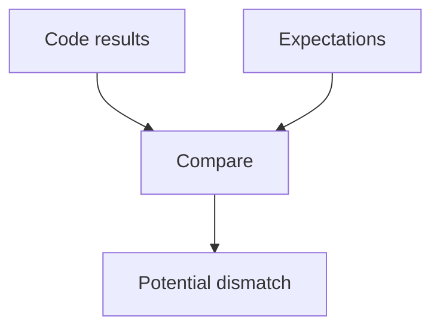
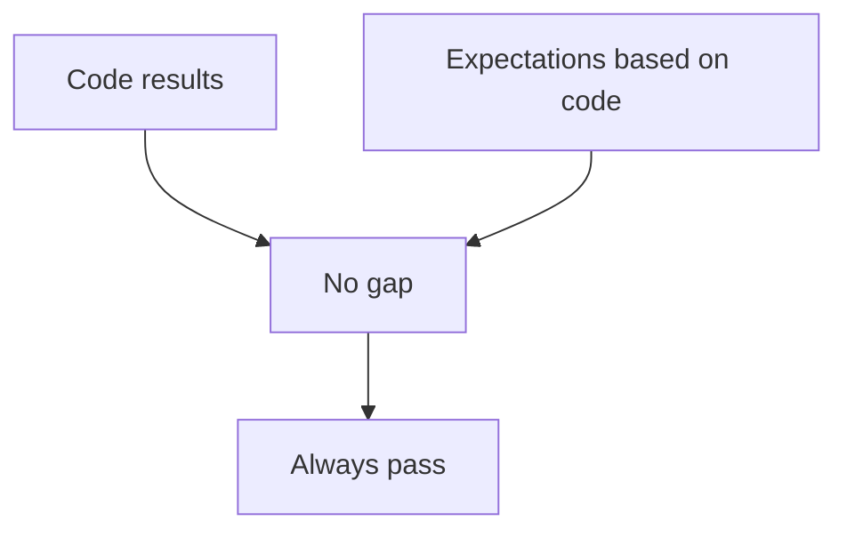
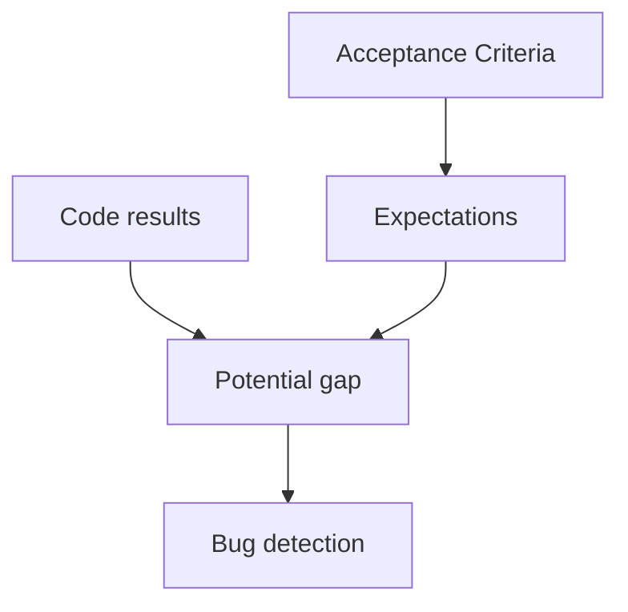

When talking about testing the first step is always to understand how the process works to actually understand what are the possibilities and constraints.

Testing is actually just comparing your code results to the expectations you have for that code.

Due to that tests are able to verify that a bug is not present inside your code but not that your code is except of bugs.

Please mind the difference between theses are it has its importance.

In the same fashion I also love to hate the sentence "Have you tested your code?".

The reason is not that I am lazy to write tests but rather than I think this expression is the perfect illustration for the hell is paved with good intentions.

When saying that to a junior developer no harm is meant. However, it is leading them in the wrong direction as basing expectations of tests on the code will generate blind tests.

When testing it is important to base them instead on the project expectations with tools like acceptance criteria and write tests before the code, so we can make sure we don't fall into that tempting trap.

