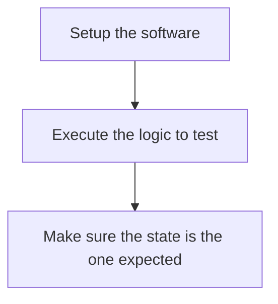
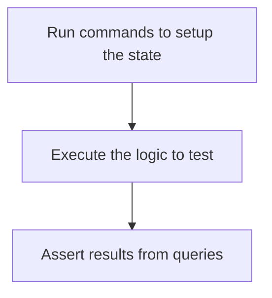

Testing is a lot different from coding and often developers tends to be stuck on what to do on their first tests.

This totally normal and natural and this part will be focusing on how and what to write in a test to make it effective.

The first point to get is what a test can and cannot do.
When testing software it is possible to assert for the presence of a specific behavior, but it is impossible to assert that bugs will be totally absent within the software.

In other term it is possible to assert that a bug is not present but impossible to insure the software is bug free.

With that in mind it is easier to understand what will be done within the test.
Setting the software in a certain context that needs to be tested.
Then run the logic to test.
Finally, assert that the new behavior is the one expected.

To make sure theses 3 steps are actually done a really common pattern while writing tests is the AAA.
- **Arrange** : this part is focused on setting the initial state from the application to make conform to the state we want to test.
- **Act** : during that part we need to execute the application.
- **Assert** : at that moment we are making sure the output state is the one we expected. 

A good practice while developing is to use the Command Query Responsibility Segregation.
When combined with testing it becomes even more powerful as it is possible to reuse commands and queries already implemented within the tests and actually make integration tests easier.

As when arranging the state it is about changing the state from the software commands can be used at that level.
In a same fashion query can be used to make sure it is possible to fetch the data to assert without modifying the state making it safer.

