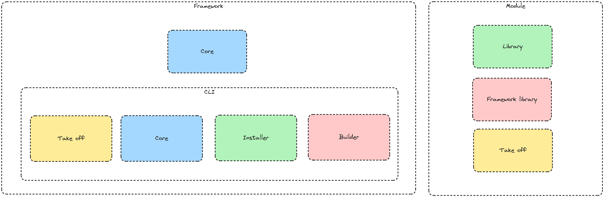

## What is Launchpad ?

Launchpad is a PHP framework to build WordPress plugins faster and with better standards.

It comes with the following features:
- A possibility to initialize a plugin in 2 commands.
- A CLI to generate classes for you.
- An architecture which is test friendly.
- Modules that allows you to extend the experience with popular libraries like Action Scheduler.

## The philosophy behind Launchpad

Today the WordPress community is notorious for its code standards.

This is due to numerous reasons such as the lack of a common architecture, the difficulty to produce proper code or even the hook API that can be obscure on some plugins.

Launchpad comes as a solution to these problem by offering a clean reusable base for plugin project allowing WordPress developers to finally work in a modern environnement at a low cost.

That's for these reasons that the base of this framework is opinionated.

However, WordPress plugin developers are also deeply attached to their freedom.

That's why the architecture is built around the developers needs but at the same time tries to enforce them as few possible by not forcing their code to extend from any class nor having to follow a certain architecture in the business logic more that the strict necessary.

Instead, the framework tries to provide a core as small as possible bundled a huge variety of blocks to the developers that they can install and use when they judge it necessary.

This notion of blocks is present at multiple level through the framework.

It can take the form of modules that are possible to quickly add into the project allowing usage from code between project in a couple of minutes.

But it can also take the form of traits that will be used to load automatically certain classes into your business classes providing helper logics or facades to handle certains operations faster.

When necessary it is also possible to create your own traits and modules to adapt the framework to your needs and own specifications without having to copy and paste code between projects.

## Architecture

[Excalidraw](https://excalidraw.com/#json=6zfELgdwfMw4qmw0wT_yB,07afeES0sQJdH6zw4N1Awg)

To go with the WordPress way the framework is modular which keeps it open.

This modularity is done at two levels.

First [the framework](https://github.com/wp-launchpad/launchpad) itself is as small as possible and every non-essential code is relegated to modules.

This keeps the framework open as anyone is free to create his own module without being validated by the framework team.

The second level where the modularity is present is inside the framework itself which is containing few code by itself and relies on packages to hold the logic.
This is done for a simple reason flexibility and keeping the framework easy to upgrade in the future.

The first part is the Core which is here to handle any logic related to the requirement of a WordPress plugin or to set up the environnement.

The second part are the CLI related packages which enable automation and that is removed when bundling for production:

- [**Core**](https://github.com/wp-launchpad/core): The core of the CLI is here to contain anything for the CLI to run and a couple of basic commands for the framework.
- [**Take off**](https://github.com/wp-launchpad/take-off): The take off is handling the initialization from the project.
- [**Installer**](https://github.com/wp-launchpad/installer): The installer is here to prevent duplicating common installation logic between modules.
- [**Builder**](https://github.com/wp-launchpad/build): The builder is handling the creation of a production package from the plugin.

Concerning the modules they are organised the following way:
- The library itself which contains the business logic.
- Potentially a framework logic which makes the link to the framework when necessary. (The main idea is to keep the main library easy to integrate to WP Rocket)
- A take-off library in charge of setting up the library automatically.